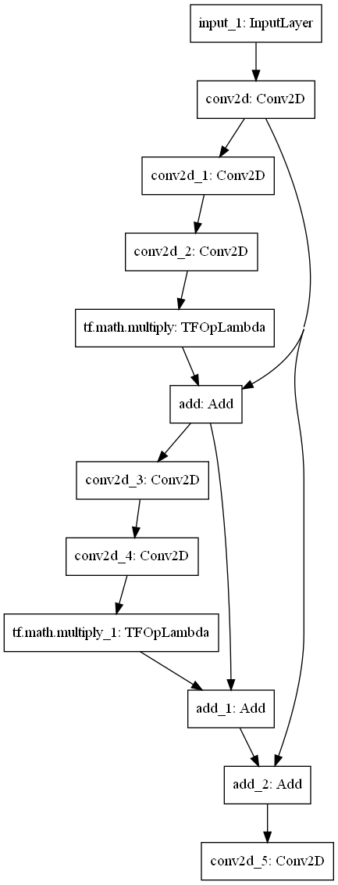

# Single-Image Super Resolution (SISR)
## What is Super Resolution?
SISR is the process of upscaling a low resolution image to high resolution.

## Examples

The images from left to right are original, interpolated through bicubic upscaling, and prediction of the neural network. To see a higher version, click on the image.

## What is the neural network model?
The neural network utilizes the concept of skip-connections. Here is a diagram of two blocks within the network.

## Network Architecture:
The model consists of 24 residual blocks. Each block contains a Convolution, Relu, Convolution, Add layers.
    
            x
		|\
		| \
		|  conv2d
		|  activation
		|  conv2d
            |  (multiply scaling)
		| /
		|/
		+ (residual scaling)
		|
		result
