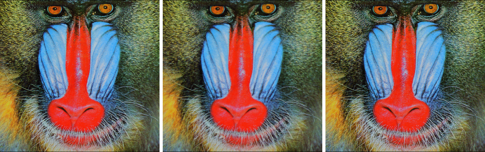
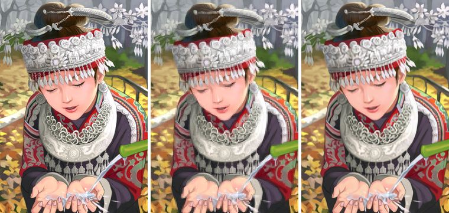

# Single-Image Super Resolution (SISR)
## What is Super-Resolution?
Super-Resolution is the process of upscaling an image from low to high resolution. Many methods exist that implement an algorithm that performs SR, such as nearest-neighbor interpolation, bicubic interpolation, and Lanczos upsampling [(here)](https://en.wikipedia.org/wiki/Comparison_gallery_of_image_scaling_algorithms). This part of my project implements deep learning methods that significantly improve upon more traditional techniques. Deep learning works by applying common patterns found within high-resolution training data onto the low-resolution image during inference.

## Examples

##### *From left to right: original, interpolated (Nearest Neighbor upscaling), and prediction (from neural network)* 
To see a higher quality version, **[click](https://github.com/JoshVEvans/Super-Resolution/tree/master/evaluation/Combined) on the images**. In some cases, the upscaled image looks even better than the original!

## Reasearch and Development
How did I get to my final model architecture? I initially started with an early known architecture called Single-Image Convolutional Neural Network ([SRCNN](https://arxiv.org/pdf/1501.00092.pdf)). This architecture consists of 2 hidden layers and an output layer that reconstructs the high-resolution image. This architecture, although better than traditional algorithms, fails to reconstruct the image properly. [SRCNN](https://arxiv.org/pdf/1501.00092.pdf) is essentially a glorified image sharpening algorithm. 

The next model I tried implementing was Very Deep Super-Resolution ([VDSR](https://arxiv.org/pdf/1511.04587.pdf)). This model improves upon the original SRCNN by adding a global skip connection, thus making upscaling much easier. Essentially, the network doesn't need to reconstruct the image entirely and instead needs to reconstruct the difference (the residual) between the high and low-resolution image.

The following model I implemented was Very Deep Super-Resolution ([VDSR](https://arxiv.org/pdf/1511.04587.pdf)). This model improves the [SRCNN](https://arxiv.org/pdf/1501.00092.pdf) architecture by adding a global skip connection connecting the input and output images.  Essentially, the neural network no longer needs to fully reconstruct a high-resolution image; instead, it only needs to reconstruct the difference (the residual) between a high and low-resolution image. 

My implementation improves upon the concept of residuals within VDSR by combining both global and local connections using an `Add` layer. Since this model is quite deep (50 Convolutional Layers), it takes a long time for the model to predict an image during inference. I created a smaller model that uses `Concatenate` layers to replace the `Add` layers, and although much smaller than the original model, it produces comparable results due to the density of connections inherent to concatenation layers.

### Model Architecture Comparison

| Methods | Depth |      Filters      | Parameters |         SSIM-x2         |          PSNR-x2           | Training Time |
| ------- | :---: | :---------------: | :--------: | :---------------------: | :------------------------: | :-----------: |
| Bicubic |   ~   |         ~         |     ~      |         0.9201          |          32.4975           |       ~       |
| SRCNN   |   3   |      64-32-3      |    20k     |         0.9389          |           36.113           |     6hrs      |
| VDSR    |  20   | (19 layers) 64-3  |    668k    |         0.9488          |          37.3448           |     8hrs      |
| Small   |  20   | (19 layers) 64-3  |   2,013k   |         0.9501          |          37.5013           |     15hrs     |
| Large   |  50   | (49 layers) 128-3 |   7,091k   | <strong>0.9541</strong> | <strong>37.9479  </strong> |     23hrs     |

### Architecture Performance

## Network Architecture:
#### The core of this model is in the residual blocks.

            x
		|\
		| \
		|  conv2d
		|  activation
		|  conv2d
            |  (multiply scaling)
		| /
		|/
		+ (residual scaling)
		|
		result

#### The larger model's residual blocks use `Add` layers to add residuals

#### The smaller model's residual blocks use `Concatenate` layers to add residuals

An image of the complete model is towards the bottom of this page.

## How do you use this model?
Put low-resolution images to upscale inside the '**inference/original**' directory. Run output.py, and the results will be written into the '**inference/output**' directory. It should take a couple of seconds to run the model for each image inside the input directory. 

If you find that the model takes too long to run, or you run out of memory, try replacing '*weights/LARGE_BEST.h5*' with other models found within the [weights](https://github.com/JoshVEvans/Super-Resolution/tree/master/weights) folder such as '*weights/SMALL_BEST.h5*' or '*weights/VDSR_BEST.h5*'.

## How can you train your own model?
The model is instantiated within [`network.py`](https://github.com/JoshVEvans/Super-Resolution/blob/master/network.py). You can play around with hyper-parameters there. First, to train the model, delete the images currently within `data/` put your training image data within that file - I recommend the [DIV2K dataset](https://data.vision.ee.ethz.ch/cvl/DIV2K/). Finally, mess with hyper-parameters in [`train.py`](https://github.com/JoshVEvans/Super-Resolution/blob/master/train.py) and run `train.py`. If you’re training on weaker hardware, I’d recommend lowering the `batch_size` below the currently set ***8*** images. Also, decrease the number of (`residual blocks`) from `24 to 9` and reduce the number of filters (`num_filters`) from `128 to 64`.

## More Examples:
#### Set 5 Evaluation Set:
Images Left to Right: Original, Nearest Neighbor, Predicted.

## [Complete Model Architecture:](md_images/model_large.png)

### Hardware - Training Statistics
##### Trained on 3070 ti
###### Batch Size: 8
###### Training Image Size: 64x64

### Author
##### Joshua Evans - [github/JoshVEvans](https://github.com/JoshVEvans)
