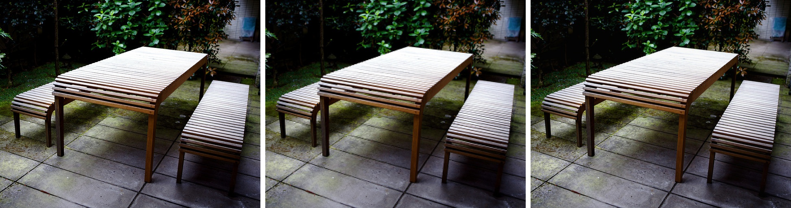
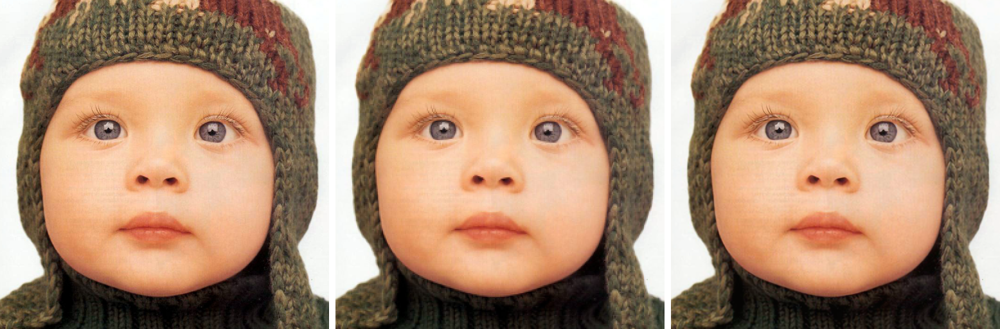

# Single-Image Super Resolution (SISR)
## What is Super Resolution?
SISR is the process of upscaling a low resolution image to high resolution.

## Examples

From left to right: original, interpolated(Nearest Neighbor upscaling), and prediction(from neural network) 
To see a higher quality version, **[click](https://github.com/JoshVEvans/Super-Resolution/tree/master/evaluation/Combined) on the images**. In some cases the upscaled image looks even better than the original!

## Network Architecture:
The model consists of 24 residual blocks. Each block contains a Convolution, Relu, Convolution, Add layers.

            x
		|\
		| \
		|  conv2d
		|  activation
		|  conv2d
            |  (multiply scaling)
		| /
		|/
		+ (residual scaling)
		|
		result

An image of the complete model is towards the bottom of this page.

## How do you use this model?
Put images you want to upscale in side the '**inference/original**' directory. Run output.py and the results will be written into the '**inference/output**' directory. It should take a couple of seconds to run the model for each image inside the input directory.

## How can you train your own model?
The model is instantiated within [`network.py`](https://github.com/JoshVEvans/Super-Resolution/blob/master/network.py). You can play around with hyper-parameters there. To train the model, first delete the images currently within `data/` put you own training data within that file - I recommend the [DIV2K dataset](https://data.vision.ee.ethz.ch/cvl/DIV2K/). Finally, mess with hyper-parameters in [`train.py`](https://github.com/JoshVEvans/Super-Resolution/blob/master/train.py) and run `train.py`. If running on relatively weaker hardware, I'd recommend lowering the `batch_size` below the currently set ***8*** images. Also lower the number of residual blocks from `24 to 9` and lower the number of filters (`num_filters`) from `128 to 64`.

## More Examples:

## Complete Model Architecture.
#### Set 5 Evaluation Set:
Images Left to Right: Original, Nearest Neighbor, Predicted.

### Author
##### Joshua Evans - [github/JoshVEvans](https://github.com/JoshVEvans)
